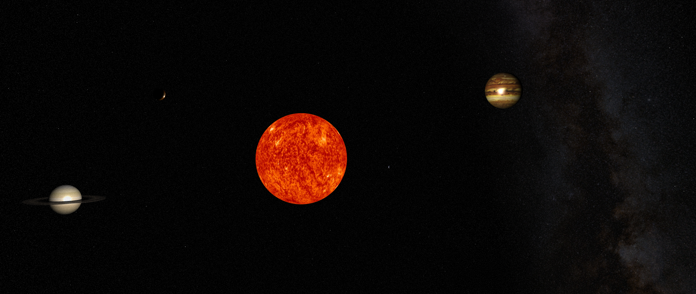
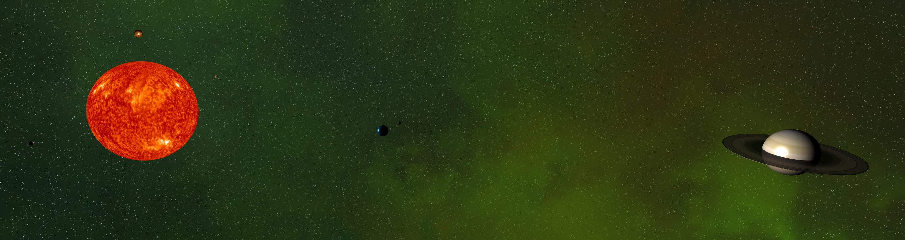

# Description

This is a model of solar system in more or less realistic scale except for the size of the sun (it should be 10 times bigger than it is)

# Deployment
- App is currently deployed [here](http://srv12.mikr.us:20341/)

# To run
- clone this repo
- go to project directory
- npm install
- npm run dev

# To make modifications

Main js file is located under `src/index.js` 
Please check parts of this code for places when you can uncomment parts in order to enable alternative backgrounds or enable new features
